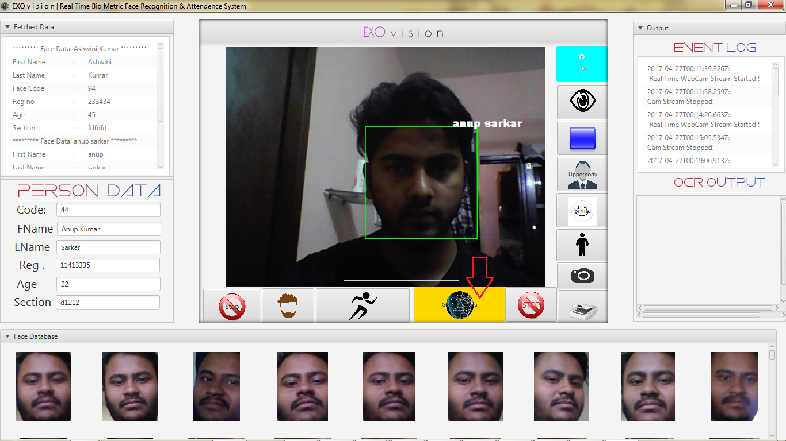
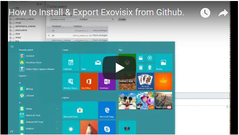

# e x o V i s i x
<p align="center">
 </div>
</p>

ExoVisix is a Smart Computer Vision Application with various functionalities. I have tried to put as many Machine Learning tools as possible into one single Application for greater productivity.

## KEY FEATURES
* Auto Attendance system Using Real Time Face Recognition
* Face Trainer
* Motion Detection
* OCR (Optical Character Reader)
* Gesture Control(Controlling Mouse Pointer Using Finger or Red Colored Object)
* Rectangle Shape Detection
* Trained Faces Image Gallery View
* Eye Detection
* Persistent Storage for Trained Faces Image Using Database

## TECHNOLOGY USED
* Core Java
* JavaCV (wrapper of Opencv )
* JavaFX
* MySQL
* Maven
* Tesseract OCR Framework
## USER INTERFACE


# Installation Guide


### Video Guide


[](https://www.youtube.com/embed/Wzwc4RUJs1Y "Video Title")

### IDE
```bash
I have developed this project using Eclipse Neon. So I highly recommend you to use this particular IDE.
   ```
   
## Maven Dependencies
```xml
     <dependency>
  	    <groupId>org.bytedeco</groupId>
  	    <artifactId>javacv-platform</artifactId>
  	    <version>1.3.2</version>
      </dependency>
  
      <dependency>
           <groupId>mysql</groupId>
           <artifactId>mysql-connector-java</artifactId>
           <version>5.1.14</version>
      </dependency>

      <dependency>
            <groupId>org.bytedeco.javacpp-presets</groupId>
            <artifactId>tesseract-platform</artifactId>
            <version>3.04.01-1.3</version>
      </dependency>

  ```
  
### Required Software
To properly run this Application on your System, At first you need to download and install the following software:

 * An implementation of **Java SE** 7 or newer:
   * **JDK**  http://www.oracle.com/technetwork/java/javase/downloads/index.html
 
 * An implementation of **JavaFX**: (Follow The Installation Instruction)
   * **JavaFX**  https://docs.oracle.com/javafx/2/installation/jfxpub-installation.htm

 * An implementation of **JavaCV**: (Follow The Installation Instruction)
   * **JavaCV**  https://github.com/bytedeco/javacv
   
 * An implementation of **MySQL Database**: 
   * **XAMPP**  https://www.apachefriends.org/download.html
 
 * To Connect MySQL with Java, You will need a connector: (Follow the installation instruction)
   * **MySQL Connector Java**  https://dev.mysql.com/downloads/connector/j/5.1.html
  
 * An implementation of **JavaFX Scene Builder**: (Follow The Installation Instruction)
   * **JavaFX Scene Builder**  https://docs.oracle.com/javafx/scenebuilder/1/installation_1-0/jsbpub-installation_1-0.htm
 

Finally, please make sure everything has the same bitness: **32-bit and 64-bit modules do not mix under any circumstances**.

# Configuration Settings 
#### ExoVision may not work properly Without these settings
#### Before executing the App, you have to make some change to below mentioned files...

## Database Settings 
* Open MySQL on XAMPP then Create a New Database & name it **ghostEye** 
* Now import attached **face_bio.sql** to the  **ghostEye** Database
* Or Create a New Schema(Table)
```sql

CREATE TABLE IF NOT EXISTS `face_bio` (
`id` int(11) NOT NULL,
  `code` int(10) NOT NULL,
  `first_name` varchar(30) NOT NULL,
  `last_name` varchar(20) NOT NULL,
  `reg` int(10) NOT NULL,
  `age` int(10) NOT NULL,
  `section` varchar(20) NOT NULL
) ENGINE=InnoDB AUTO_INCREMENT=1 DEFAULT CHARSET=latin1;


ALTER TABLE `face_bio`
 ADD PRIMARY KEY (`id`);
 
 ALTER TABLE `face_bio`
MODIFY `id` int(11) NOT NULL AUTO_INCREMENT,AUTO_INCREMENT=1;

```

* Now Open src/application/Database.java and provide your MySQL DB credintials
```java
package application;

import java.sql.*;
import java.util.ArrayList;
import java.util.List;

class Database {
	public int code;

	public String fname;
	public String Lname;
	public int reg;
	public int age;
	public String sec;

	public final String Database_name = "Your Database";
	public final String Database_user = "Your Database user Name";
	public final String Database_pass = "Your Database Password";

	.
	.
	.
```
## OCR Settings
* To use tesseract api,at first you have to install tesseract with desired language training data on your system.After That you have to mention the installation folder.

```java
Now goto src/application/OCR.java ,in line 36 provide your tesseract installation directory name.
```

# Tips
* When you going to train a new face try to capture at least 10 pictures of a single person in different angle.keep it in mind that the more number of training image in different angle and posture, the more accurate will be  face recognition.
* After everything done ,kindly empty the **faces** folder.There is a test_face image.You have to delete it.

# Please Note:
Please Keep it in mind ,sometimes the face recognition algorithm provides wrong output if a person is not trained or unknown to the system.The reason behind this is that the face recognition algorithm guess the face with the nearest match.when it does not find any match ,the system pick any face with a nearest match.this is  why it sometimes provides wrong output.

# Video Tutorial
* Visit https://www.youtube.com/watch?v=6UnBZFvY8HE&t=3s


# LICENCE

```licence

MIT License

Copyright (c) 2017 Anup Kumar Sarkar

Permission is hereby granted, free of charge, to any person obtaining a copy
of this software and associated documentation files (the "Software"), to deal
in the Software without restriction, including without limitation the rights
to use, copy, modify, merge, publish, distribute, sublicense, and/or sell
copies of the Software, and to permit persons to whom the Software is
furnished to do so, subject to the following conditions:

The above copyright notice and this permission notice shall be included in all
copies or substantial portions of the Software.

THE SOFTWARE IS PROVIDED "AS IS", WITHOUT WARRANTY OF ANY KIND, EXPRESS OR
IMPLIED, INCLUDING BUT NOT LIMITED TO THE WARRANTIES OF MERCHANTABILITY,
FITNESS FOR A PARTICULAR PURPOSE AND NONINFRINGEMENT. IN NO EVENT SHALL THE
AUTHORS OR COPYRIGHT HOLDERS BE LIABLE FOR ANY CLAIM, DAMAGES OR OTHER
LIABILITY, WHETHER IN AN ACTION OF CONTRACT, TORT OR OTHERWISE, ARISING FROM,
OUT OF OR IN CONNECTION WITH THE SOFTWARE OR THE USE OR OTHER DEALINGS IN THE
SOFTWARE.

```

       

 


